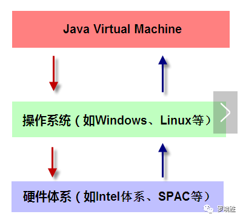
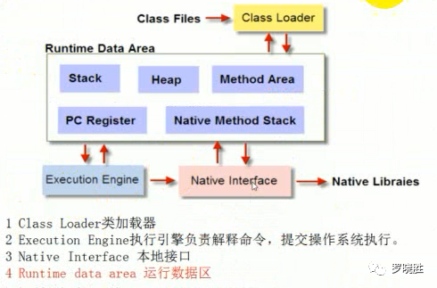
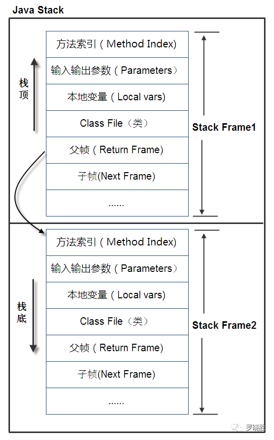

# 0-1Learning

## Java虚拟机简介

### JVM简介
* JVM是Java Virtual Machine（Java虚拟机）的缩写，
* JVM是一种用于计算设备的规范，它是一个虚构出来的计算机，是通过在实际的计算机上仿真模拟各种计算机功能来实现的。
* Java语言的一个非常重要的特点就是与**平台的无关性**。而使用Java虚拟机是实现这一特点的关键
* JVM屏蔽了与具体操作系统平台相关的信息，使Java程序只需生成在Java虚拟机上运行的目标代码（字节码）,就可以在多种平台上不加修改地运行。JVM在执行字节码时，实际上最终还是把字节码解释成具体平台上的机器指令执行。
* Java虚拟机包括
    * 程序计数器：当前线程所执行的字节码的行号指示器，用于记录正在执行的虚拟机字节指令地址，线程私有。
    * Java虚拟栈：存放基本数据类型、对象的引用、方法出口等，线程私有。
    * Native方法栈：和虚拟栈相似，只不过它服务于Native方法，线程私有。
    * Java堆：java内存最大的一块，所有对象实例、数组都存放在java堆，GC回收的地方，线程共享。
    * 方法区：存放已被加载的类信息、常量、静态变量、即时编译器编译后的代码数据等。（即永久带），回收目标主要是常量池的回收和类型的卸载，各线程共享

    
### JVM组成
* JVM操作流程

* JVM是运行在操作系统之上的，它与硬件没有直接的交互，我们再来看JVM由哪些部分组成，如下图所示：

#### Class Loader 类加载器
* 类加载器的作用是加载类文件到内存，
* 比如编写一个HelloWord.java 程序，然后通过javac 编译成class 文件，
* 那怎么才能加载到内存中被执行呢？Class Loader 承担的就是这个责任，那不可能随便建立一个.class 文件就能被加载的，Class Loader 加载的class 文件是有格式要求。
* Class Loader 只管加载，只要符合文件结构就加载，至于说能不能运行，则不是它负责的，那是由Execution Engine 负责的。

#### Execution Engine 执行引擎
* 执行引擎也叫做解释器(Interpreter) ，负责解释命令，提交操作系统执行。

#### Native Interface 本地接口
* 本地接口的作用是融合不同的编程语言为Java 所用，它的初衷是融合C/C++ 程序，Java 诞生的时候是C/C++ 横行的时候，要想立足，必须有一个聪明的、睿智的调用C/C++ 程序，于是就在内存中专门开辟了一块区域处理标记为native 的代码，它的具体做法是Native Method Stack 中登记native 方法，在Execution Engine 执行时加载native libraies 。目前该方法使用的是越来越少了，除非是与硬件有关的应用，比如通过Java 程序驱动打印机，或者Java 系统管理生产设备，在企业级应用中已经比较少见，因为现在的异构领域间的通信很发达，比如可以使用Socket 通信，也可以使用Web Service 等等，不多做介绍。

#### Runtime data area 运行数据区
* 运行数据区是整个JVM 的重点。我们所有写的程序都被加载到这里，之后才开始运行，Java 生态系统如此的繁荣，得益于该区域的优良自治。
* 整个JVM 框架由加载器加载文件，然后执行器在内存中处理数据，需要与异构系统交互是可以通过本地接口进行，瞧，一个完整的系统诞生了！

### JVM内存管理
所有的数据和程序都是在运行数据区存放，它包括以下几部分：

#### Stack 栈
* 栈也叫栈内存，是Java程序的运行区，是在线程创建时创建，它的生命期是跟随线程的生命期，线程结束栈内存也就释放，对于栈来说不存在垃圾回收问题，只要线程一结束，该栈就Over。
* 问题出来了：栈中存的是哪些数据呢？有什么是格式呢？
    * 栈中的数据都是以栈帧（Stack Frame）的格式存在，栈帧是一个内存区块，是一个数据集，是一个有关方法(Method)和运行期数据的数据集，当一个方法A被调用时就产生了一个栈帧F1，并被压入到栈中，A方法又调用了B方法，于是产生栈帧F2也被压入栈，执行完毕后，先弹出F2栈帧，再弹出F1栈帧，遵循“先进后出”原则。
* 那栈帧中到底存在着什么数据呢？
    * 栈帧中主要保存3类数据：
        * 本地变量（Local Variables），包括输入参数和输出参数以及方法内的变量；
        * 栈操作（Operand Stack），记录出栈、入栈的操作；
        * 栈帧数据（Frame Data），包括类文件、方法等等。

#### Heap 堆内存
* 堆内存组成
一个JVM实例只存在一个堆内存，堆内存的大小是可以调节的。类加载器读取了类文件后，需要把类、方法、常变量放到堆内存中，以方便执行器执行，
堆内存分为三部分：
    * Permanent Space 永久存储区
        * 永久存储区是一个常驻内存区域，用于存放JDK自身所携带的Class,Interface的元数据，也就是说它存储的是运行环境必须的类信息，被装载进此区域的数据是不会被垃圾回收器回收掉的，关闭JVM才会释放此区域所占用的内存。
    * Young Generation Space 新生区
        * 新生区是类的诞生、成长、消亡的区域，一个类在这里产生，应用，最后被垃圾回收器收集，结束生命。新生区又分为两部分：伊甸区（Eden space）和幸存者区（Survivor pace），所有的类都是在伊甸区被new出来的。幸存区有两个：0区（Survivor 0 space）和1区（Survivor 1 space）。当伊甸园的空间用完时，程序又需要创建对象，JVM的垃圾回收器将对伊甸园区进行垃圾回收，将伊甸园区中的不再被其他对象所引用的对象进行销毁。然后将伊甸园中的剩余对象移动到幸存0区。若幸存0区也满了，再对该区进行垃圾回收，然后移动到1区。那如果1区也满了呢？再移动到养老区。
    * Tenure generation space养老区
        * 养老区用于保存从新生区筛选出来的JAVA对象，一般池对象都在这个区域活跃。   
    * 堆（新生代和老年代）方法区（永久代）
三个区的示意图如下：
 

#### Method Area 方法区
方法区是被所有线程共享，该区域保存所有字段和方法字节码，以及一些特殊方法如构造函数，接口代码也在此定义。
 
#### PC Register 程序计数器
每个线程都有一个程序计数器，就是一个指针，指向方法区中的方法字节码，由执行引擎读取下一条指令。

#### Native Method Stack 本地方法栈
 
  
### GC JVM垃圾回收

#### GC (Garbage Collection)的基本原理：
将内存中不再被使用的对象进行回收，GC中用于回收的方法称为收集器，由于GC需要消耗一些资源和时间，Java在对对象的生命周期特征进行分析后，按照新生代、旧生代的方式来对对象进行收集，以尽可能的缩短GC对应用造成的暂停

* 对新生代的对象的收集称为minor GC；
* 对旧生代的对象的收集称为Full GC；
* 程序中主动调用System.gc()强制执行的GC为Full GC。
* 不同的对象引用类型， GC会采用不同的方法进行回收，JVM对象的引用分为了四种类型：
    * 强引用（Strong Reference）：默认情况下，对象采用的均为强引用（这个对象的实例没有其他对象引用，GC时才会被回收）
        * 应用场景:如Object obj = new Object(); 。只要强引用存在则GC时则必定不被回收。
    * 软引用（Soft Reference）：用于描述还有用但非必须的对象，当堆将发生OOM（Out Of Memory）时则会回收软引用所指向的内存空间，若回收后依然空间不足才会抛出OOM。一般用于实现内存敏感的高速缓存
        * 当真正对象被标记finalizable以及的finalize()方法调用之后并且内存已经清理, 那么如果SoftReference object还存在就被加入到它的 ReferenceQueue.只有前面几步完成后,Soft Reference和Weak Reference的get方法才会返回null
    * 弱引用（Weak Reference）：在GC时一定会被GC回收
    * 虚引用（Phantom Reference)：由于虚引用只是用来得知对象是否被GC
        * 当一个对象的finalize方法已经被调用了之后，这个对象的幽灵引用会被加入到队列中。通过检查该队列里面的内容就知道一个对象是不是已经准备要被回收了.
         虚引用和软引用和弱引用都不同,它会在内存没有清理的时候被加入引用队列.虚引用的建立必须要传入引用队列,其他可以没有
    
#### GC算法：
1. 引用计数法：缺点是无法处理循环引用问题
1. 标记-清除算法：标记所有从根结点开始的可达对象，缺点是会造成内存空间不连续，不连续的内存空间的工作效率低于连续的内存空间，不容易分配内存
2. 复制算法（Java堆中新生代的垃圾回收算法）缺点:将内存空间分成两块，每次将正在使用的内存中存活对象复制到未使用的内存块中，之后清除正在使用的内存块。算法效率高，但是代价是系统内存折半。适用于新生代(存活对象少，垃圾对象多)
3. 标记-压缩算法（或称为标记-整理算法，Java堆中老年代的垃圾回收算法）标记－清除的改进，清除未标记的对象时还将所有的存活对象压缩到内存的一端，之后，清理边界所有空间既避免碎片产生，又不需要两块同样大小的内存快，性价比高。适用于老年代。
5. 分代
* 说明 
    * 堆中区分的新生代和老年代是为了垃圾回收，新生代中的对象存活期一般不长，而老年代中的对象存活期较长，所以当垃圾回收器回收内存时，新生代中垃圾回收效果较好，会回收大量的内存，而老年代中回收效果较差，内存回收不会太多。
    * 基于以上特性，新生代中一般采用复制算法，因为存活下来的对象是少数，所需要复制的对象少，而老年代对象存活多，不适合采用复制算法，一般是标记整理和标记清除算法。
    * 因为复制算法需要留出一块单独的内存空间来以备垃圾回收时复制对象使用，所以将新生代分为eden区和两个survivor区，每次使用eden和一个survivor区，另一个survivor作为备用的对象复制内存区。

