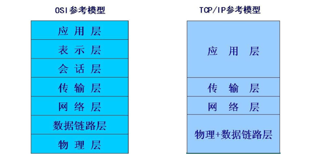

# 0-1Learning

## 网络编程

### 要点
* 网络基础知识
    * OSI参考模型
    * IP地址和端口号
* Socket编程
    * Socket原理
    * 基于TCP的Socket编程
    * 基于多线程的Socket编程

### 网络基础知识
* 网络应用程序
    * 在已实现了网络互联的不同的计算机上运行的程序，这些程序之 间可以交换数据

* 网络编程 — socket编程
    * 通过使用套接字来达到进程间通信目的编程就是网络编程

### IP地址和端口号
#### IP
* TCP/IP协议
    * 协议 —网络中计算机之间通信的规则
    * 大多数的网络协议都以TCP/IP协议为基础
* IP地址
    * IP地址为每台计算机指定一个标识号，通过这个标识号来指定要接收数据的计算机和识别发送 数据的计算机
* IPV4/IPV6
    * IPV4—	4个字节，即32位的二进制数表示
    * IPV6—	16个字节的格式来表示IP地址

#### 端口号
一台计算机运上运行多个网络程序，IP地址只能保证把数据送到该计算机但如何确定把这些数据交给哪个程序呢
    * 端口号是一个整数，用于表示该数据帧交给哪个应用程序来处理
        * 同一台计算机上不能有两个使用同一个端口的程序运行
        * 端口数范围为0~6535
        * 0~1023用于一些知名的网络服务和应用，用户的普通网络程序应使用1024以上的端口号

### TCP与UDP
* TCP（Transmission Control Protocol)
    * 面向连接的通信协议
    * 提供两台计算机间的可靠的、端到端的字节流通信的协议

* UDP（User Datagram Protocal ）
    * 无连接的通信协议
    * UDP不保证可靠数据的传输

### Socket原理
* Socket原理
    * Socket—套接字
    * 是网络应用程序编程的接口和一种机制
    * 用套接字中的相关函数来建立连接和完成通信
    * Socket可以看成在两个程序进行通讯连接中的一个端点
    * 将区分不同应用程序进程的三个参数
        * 通信的目的的IP地址
        * 使用的传输层协议
        * 使用的端口号与一个socket绑定

* TCP套接字
    * 较可靠的双向流协议
    * 发送任意数量的数据
    * 提供消息确认、错误检测和错误恢复等服务

* UDP套接字
    * 不可靠

### 基于TCP的Socket编程
* 利用TCP协议进行通信  两个应用程序，有主从之分 一个称为服务器程(Server)， 另外一个称为客户机程(Client)
* 交互过程
(1)	服务器程序创建一个ServerSocket,然后调用accept方法等待客户来连接
(2)	客户端程序创建一个socket 并请求与服务器建立连接
(3)	刚才建立了连接的两个socket在一个单独的线程上对话
(4)	服务器开始等待新的连接请求

* 基于TCP的Socket编程 —— java.net.ServerSocket
    * 实现服务器套接字
    * 构造函数
        * ServerSocket(int port)
        * ServerSocket(int port, int maxqu)
    * accept( ) 方法用于等待客户端触发通信，返回值类型为Socket

* 基于TCP 的Socket编程 —— java.net.Socket
    * 实现客户端套接字
    * 构造函数
        * Socket(String hostName, int port)
        * Socket(InetAddress a, int port)
    * 可用方法
        * InetAddress getInetAddress( )
        * int getPort( )
        * int getLocalPort( )
        * InputStream getInputStream()
        * OutputStream getOutputStream()
        * void close()

